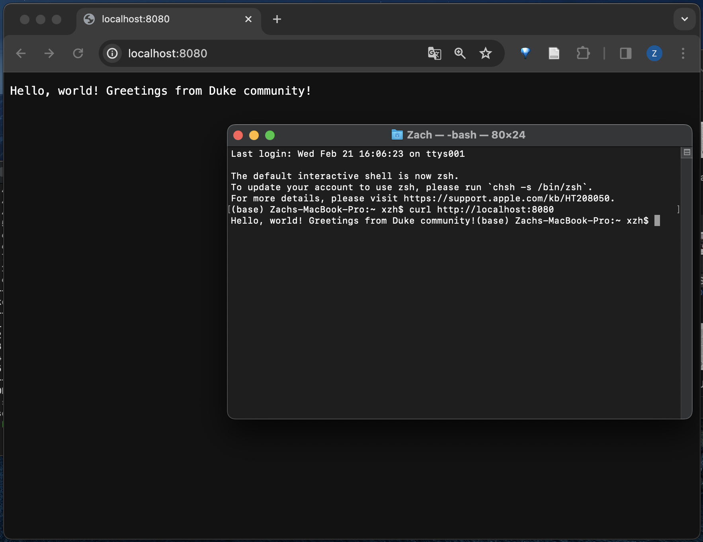

# Rust Actix Web Service Containerization

## Introduction

This project is about containerizing a simple Rust Actix web application using Docker. The purpose is to create an isolated and consistent environment for the application to run, which simplifies deployment and development across different machines.

## Requirements

- Docker installed.
- Basic knowledge of Docker commands and containerization principles.
- Rust programming language and Cargo package manager installed.

## Getting Started

### Building the Docker Image

1. **Write the Dockerfile:** Create a `Dockerfile` in the root directory of your Rust Actix project. Below is a basic example of what the Dockerfile might look like:

```Dockerfile
# Use the official Rust image as a parent image
FROM rust:latest

# Set the working directory in the container
WORKDIR /usr/src/myapp

# Copy the current directory contents into the container at /usr/src/myapp
COPY . .

# Build the application
RUN cargo install --path .

# Expose the port the server listens on
EXPOSE 8080

# Define the command to run the application
CMD ["myapp"]
```

2. **Build the Docker image:** Run the following command in your terminal:

```bash
docker build -t my_rust_actix_web_app .
```

This command will build a Docker image with the tag `my_rust_actix_web_app` based on the instructions in your Dockerfile.

### Running the Container Locally

After the image is built, you can run the container with:

```bash
docker run -d -p 8080:8080 my_rust_actix_web_app
```

This command runs the container in detached mode, maps port 8080 of the container to port 8080 on your local machine, and uses the image `my_rust_actix_web_app`.

## Documentation

### Dockerfile Explanation

- `FROM rust:latest`: This line sets the base image for subsequent instructions. In this case, we are using the latest official Rust image.
- `WORKDIR /usr/src/myapp`: This sets the working directory for any `RUN`, `CMD`, `ENTRYPOINT`, `COPY`, and `ADD` instructions that follow in the Dockerfile.
- `COPY . .`: This copies new files or directories from the source directory to the destination container filesystem.
- `RUN cargo install --path .`: This installs the Rust application and its dependencies.
- `EXPOSE 8080`: This informs Docker that the container listens on the specified network port at runtime.
- `CMD ["myapp"]`: This provides the default execution command for the container.

### Container Functionality

- Verify that the application is accessible and functioning correctly by navigating to `http://localhost:8080` in your web browser or using a tool like `curl`.

## Deliverables

- `Dockerfile`: Included in the root directory.
- `Screenshots`: 
- `Writeup of process`: This README includes a comprehensive writeup of the containerization process.


## Conclusion

This README provides a guide on how to containerize a Rust Actix web application. Follow the steps to build and run the Docker container, and refer to the documentation for an explanation of the Dockerfile and build process.
